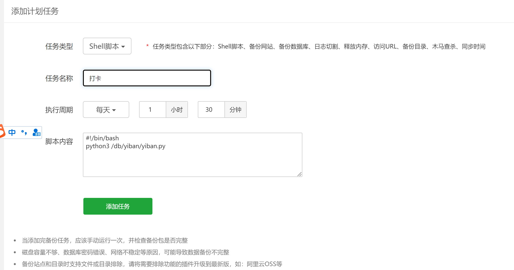
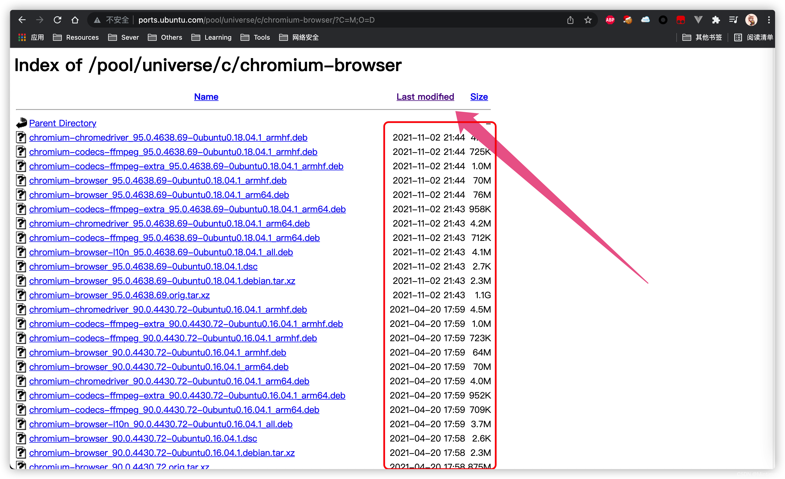
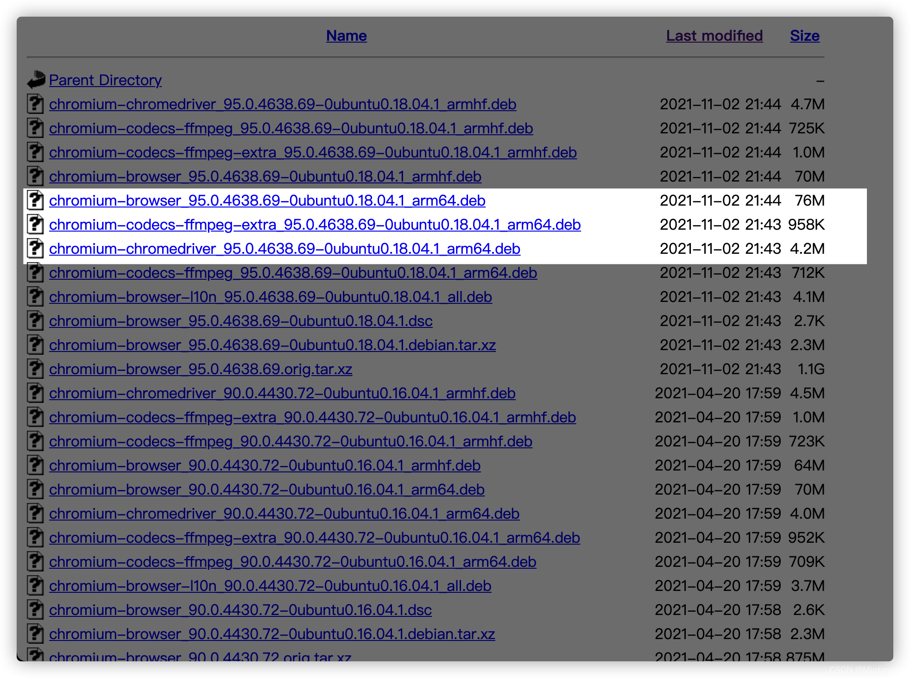
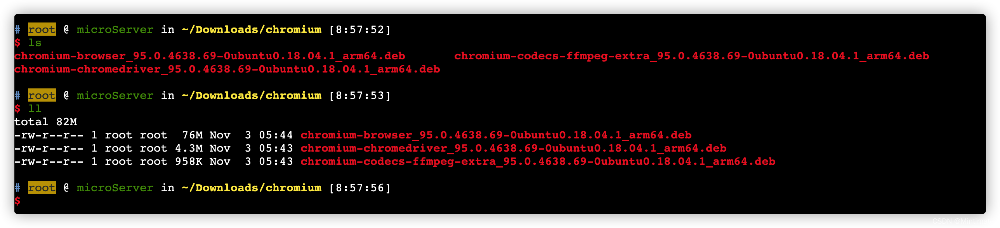
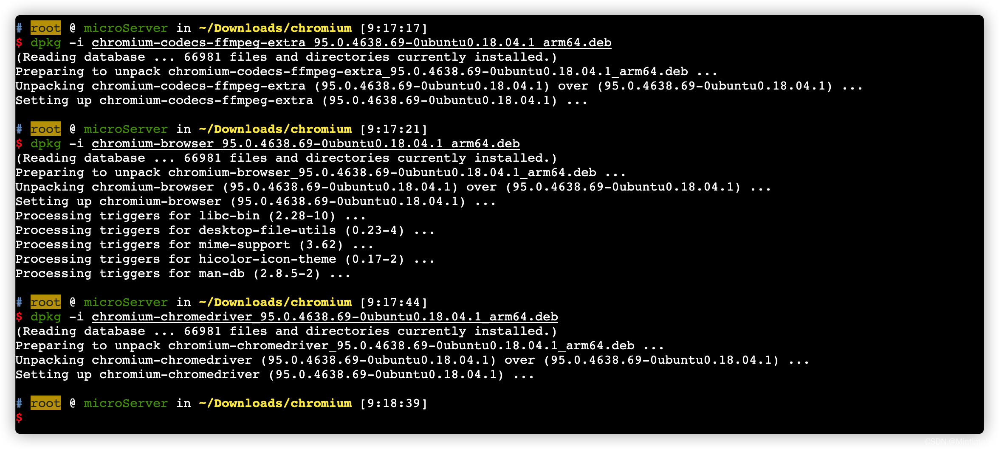
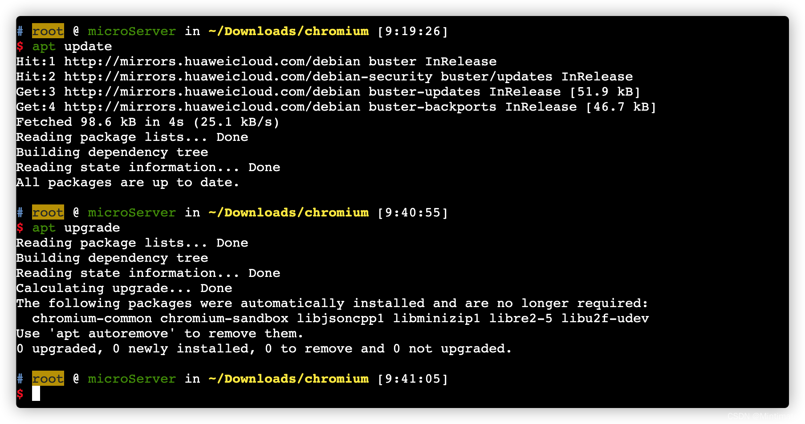

# 涉外易班自动打卡

> 看不到本文档图片请用电脑打开，或[点击](http://www.zhangzhiyu.live:8900/vuepress/guide/python/%E6%B6%89%E5%A4%96%E6%98%93%E7%8F%AD%E8%87%AA%E5%8A%A8%E6%89%93%E5%8D%A1.html)


## 使用selenium

> 此方法使用代码控制浏览器进行打卡，属于模拟操作，比较简单可控

###  :fire: win10系统

#### 依赖

1. 谷歌浏览器

   如果没有可[点击](https://pan.baidu.com/s/1kDepNH15qa64MLwYhNVT3g?pwd=fmg4)

   下载 ChromeStandaloneSetup64 

2. python3环境

   如果没有可[点击](https://pan.baidu.com/s/1kDepNH15qa64MLwYhNVT3g?pwd=fmg4)

   下载 python-3.10.5-amd64 (1)

3. stealth.min.js 

   可点击[下载](https://pan.baidu.com/s/11JoDOsnTrv_0-LB-8ARH2w?pwd=3php)

4. python3环境安装后，需要pip下载selenium，chromedriver_autoinstaller

   ```shell
   pip install chromedriver_autoinstaller
   ```

   ```shell
   pip install selenium
   ```


#### python脚本

> 需要将stealth.min.js 和python脚本放在同一目录
>
> 脚本运行后，第一次比较慢，会下载驱动在当前目录，并生成一个文件夹，不要删除

自行修改代码中学号和身份证后六位

```python
'''

@ 文件功能描述：涉外自动化打卡

@ 创建人：时不待我

@ 博客：http://www.zhangzhiyu.live:8900/

'''

from time import sleep
from selenium import webdriver
from selenium.webdriver.common.by import By
from selenium.webdriver.chrome.options import Options
from selenium.webdriver.support.wait import WebDriverWait
from selenium.webdriver.support import expected_conditions
import chromedriver_autoinstaller
# 目标地址
url = "http://xg.hieu.edu.cn/index"

mobile_emulation = {

    "deviceMetrics": {"width": 360, "height": 640, "pixelRatio": 3.0},

    "userAgent": "Mozilla/5.0 (iPhone; CPU iPhone OS 14_7_1 like Mac OS X) AppleWebKit/605.1.15 (KHTML, like Gecko)  "
                 "Mobile/15E148 yiban_iOS/5.0"}


chrome_options = Options()

chrome_options.add_experimental_option("mobileEmulation", mobile_emulation)  # 这里看清楚了，不是add_argument

with open('stealth.min.js') as f:
    js = f.read()

# 下载对应驱动
chromedriver_autoinstaller.install(True)
# 操作的目标浏览器
driver = webdriver.Chrome(
    chrome_options=chrome_options)  # 这里的chrome_options 建议都使用 desired_capabilities ，应为在Grid分布式中比较方便

driver.execute_cdp_cmd("Page.addScriptToEvaluateOnNewDocument", {
    "source": js
})

# 浏览器打开目标地址
driver.get(url)
sleep(1)

# 定位输入框
driver.find_element(By.ID, "uname").click()
# 清除输入框中的内容
driver.find_element(By.ID, "uname").clear()
# 输入框账号
driver.find_element(By.ID, "uname").send_keys(u"学号")
# 定位输入框
driver.find_element(By.ID, "pd_mm").click()
# 清除输入框中的内容
driver.find_element(By.ID, "pd_mm").clear()
# 输入框密码
driver.find_element(By.ID, "pd_mm").send_keys(u"身份证后六位")
# 点击登陆
driver.find_element(By.NAME, "submit").click()
# 等待网页加载
# 创建显示等待对象
# 设置等待条件（等搜索结果的div出现）
WebDriverWait(driver, 3).until(
    expected_conditions.presence_of_element_located(
        (By.XPATH, '/html/body/div/div[2]/ul[2]/li[1]')
    )
)
# 点击今日打卡
driver.find_element(By.XPATH, "/html/body/div/div[2]/ul[2]/li[1]").click()
# 等待网页加载
sleep(1)

if driver.find_element(By.XPATH, "/html/body/div/div/div[2]/div[1]/button/span[2]").text == "打卡":
    # 点击打卡
    driver.find_element(By.ID, "data_list_id_add_btn").click()
    # 等待网页加载
    sleep(4)
    # 点击位置确定
    driver.find_element(By.XPATH, "/html/body/div[12]/div[2]/div/div/div/div[4]/button").click()
    # 点击保存
    driver.find_element(By.XPATH, "/html/body/div[1]/div/div/div/div/form/button[2]").click()
    sleep(1)
    # 点击确定
    driver.find_element(By.XPATH, "/html/body/div[12]/div[2]/div/div/div/div[4]/button").click()
    # 等待网页加载
    sleep(1)
    if driver.find_element(By.XPATH, "/html/body/div/div/div[2]/div[1]/button/span[2]").text == "已打卡":
        print("打卡成功")
    else:
        print("打卡失败")
else:
    print("已过打卡")

sleep(2)
driver.quit()
```

#### 定时任务

win系统由于不是24小时运行，所以定时任务有很多局限性，如有需要可[点击](https://blog.csdn.net/junzixing1985/article/details/125613022)自行设置

###  :fire: 服务器部署

> 使用阿里云服务器IP地址要在长沙，否则会出现异地定位
>
> 可以使用阿里云自动打卡之后，可以当天自己手动修改定位，以避免班委早晨催促

#### amd64架构

##### CentOS 安装chrome

```shell
wget https://dl.google.com/linux/direct/google-chrome-stable_current_x86_64.rpm
yum install -y google-chrome-stable_current_x86_64.rpm  # 默认安装在/opt/google/chrome/ 
# yum autoremove -y google-chrome  卸载
```

安装完成之后会显示版本，或者使用下面的命令查看版本

```bash
/opt/google/chrome/chrome -version
```


##### Ubuntu安装chrome

```shell
apt update
apt install libxss1 libappindicator1 libindicator7  # 安装软件依赖
wget https://dl.google.com/linux/direct/google-chrome-stable_current_amd64.deb  # 下载最新版chrome
dpkg -i google-chrome-stable_current_amd64.deb
# 如果提示缺少某些依赖无法安装，可以试一下 apt install -f
google-chrome --version  # 查看当前chrome版本
```


##### python依赖项

```shell
pip install selenium 
```

```shell
pip install chromedriver_autoinstaller
```

stealth.min.js

下载地址

链接: https://pan.baidu.com/s/11JoDOsnTrv_0-LB-8ARH2w?pwd=3php 

提取码: 3php 

##### python自动打卡脚本

自行修改代码中

1. **学号和身份证后六位**
2. **日志及stealth.js路径**

```python
'''

@ 文件功能描述：涉外自动化打卡

@ 创建人：时不待我

@ 博客：http://www.zhangzhiyu.live:8900/

'''
import time
from selenium import webdriver
from selenium.webdriver.common.by import By
from selenium.webdriver.chrome.options import Options
from selenium.webdriver.support.wait import WebDriverWait
from selenium.webdriver.support import expected_conditions
import chromedriver_autoinstaller
# 目标地址
url = "http://xg.hieu.edu.cn/index"
# 日志名
tmp_file_name = '/www/wwwroot/yiban/zzy打卡日志.txt'
mobile_emulation = {

    "deviceMetrics": {"width": 360, "height": 640, "pixelRatio": 3.0},

    "userAgent": "Mozilla/5.0 (iPhone; CPU iPhone OS 14_7_1 like Mac OS X) AppleWebKit/605.1.15 (KHTML, like Gecko)  "
                 "Mobile/15E148 yiban_iOS/5.0"}

chrome_options = Options()

chrome_options.add_experimental_option("mobileEmulation", mobile_emulation)  # 这里看清楚了，不是add_argument
chrome_options.add_argument('--headless')
chrome_options.add_argument('--disable-gpu')
chrome_options.add_argument('--no-sandbox') # 这个配置很重要
with open('/www/wwwroot/yiban/stealth.min.js') as f:
    js = f.read()

# 下载对应驱动
chromedriver_autoinstaller.install()
# 操作的目标浏览器
driver = webdriver.Chrome(
    chrome_options=chrome_options)  # 这里的chrome_options 建议都使用 desired_capabilities ，应为在Grid分布式中比较方便

driver.execute_cdp_cmd("Page.addScriptToEvaluateOnNewDocument", {
    "source": js
})
# 浏览器打开目标地址
driver.get(url)
time.sleep(1)
# 定位输入框
driver.find_element(By.ID, "uname").click()
# 清除输入框中的内容
driver.find_element(By.ID, "uname").clear()
# 输入框账号
driver.find_element(By.ID, "uname").send_keys(u"学号")
# 定位输入框
driver.find_element(By.ID, "pd_mm").click()
# 清除输入框中的内容
driver.find_element(By.ID, "pd_mm").clear()
# 输入框密码
driver.find_element(By.ID, "pd_mm").send_keys(u"身份证后6位")
# 点击登陆
driver.find_element(By.NAME, "submit").click()
# 等待网页加载
# 创建显示等待对象
# 设置等待条件（等搜索结果的div出现）
WebDriverWait(driver, 3).until(
    expected_conditions.presence_of_element_located(
        (By.XPATH, '/html/body/div/div[2]/ul[2]/li[1]')
    )
)
# 点击今日打卡
driver.find_element(By.XPATH, "/html/body/div/div[2]/ul[2]/li[1]").click()
# 等待网页加载
time.sleep(1)

if driver.find_element(By.XPATH, "/html/body/div/div/div[2]/div[1]/button/span[2]").text == "打卡":
    # 点击打卡
    driver.find_element(By.ID, "data_list_id_add_btn").click()
    # 等待网页加载
    time.sleep(4)
    # 点击位置确定
    driver.find_element(By.XPATH, "/html/body/div[12]/div[2]/div/div/div/div[4]/button").click()
    # 点击保存
    driver.find_element(By.XPATH, "/html/body/div[1]/div/div/div/div/form/button[2]").click()
    time.sleep(1)
    # 点击确定
    driver.find_element(By.XPATH, "/html/body/div[12]/div[2]/div/div/div/div[4]/button").click()
    # 等待网页加载
    time.sleep(1)
    if driver.find_element(By.XPATH, "/html/body/div/div/div[2]/div[1]/button/span[2]").text == "已打卡":
        with open(tmp_file_name, 'a') as f:
            f.write("{}".format(str(time.strftime("%Y-%m-%d %H:%M:%S ", time.localtime()))))
            f.write("打卡成功\n\n")
    else:
        with open(tmp_file_name, 'a') as f:
            f.write("{}".format(str(time.strftime("%Y-%m-%d %H:%M:%S ", time.localtime()))))
            f.write("打卡失败\n\n")

else:
    with open(tmp_file_name, 'a') as f:
        f.write("{}".format(str(time.strftime("%Y-%m-%d %H:%M:%S ", time.localtime()))))
        f.write("已过打卡\n\n")
driver.quit()
```

##### shell脚本

自行更改路径

```shell
#!/bin/bash
python3 /db/yiban/yiban.py
```

##### 定时任务

请自行搜索

宝塔可使用计划任务



#### arm64架构（树莓派)

##### 安装Chromium

> Chromium是谷歌Chrome的开源版本，不同与Chrome，Chromium的很多代码由开源社区提供。
>
> Google并没有发布[arm](https://so.csdn.net/so/search?q=arm&spm=1001.2101.3001.7020)版本的桌面版本Chrome；所以，如果要在树莓派的arm64版本Debian安装浏览器，建议安装Chromium

 ***教程适用于Debian系统，不限于基于Debian的系统（如：Ubuntu）。*** 

 [Debian](https://so.csdn.net/so/search?q=Debian&spm=1001.2101.3001.7020)预编译版本Chromium下载：http://ports.ubuntu.com/pool/universe/c/chromium-browser 

  

选择下载文件
我们需要下载什么呢？一般是：

- chromium-codecs-ffmpeg-extra_******arm64.deb：chromium依赖的ffmpeg文件。_
- chromium-browser*****arm64.deb：chromium主体文件。
- chromium-chromedriver******_arm64.deb：chromedrive驱动，如无需代码驱动chromium，可以不安装。


比如，下载95.0版本的chromium： 

  

###### 下载

复制下载地址(请自行复制高版本下载链接替换下方)，我们到树莓派上，使用`wget`下载 ：

```shell
# 下载chromium-browser
wget 'http://ports.ubuntu.com/pool/universe/c/chromium-browser/chromium-browser_95.0.4638.69-0ubuntu0.18.04.1_arm64.deb'
# 下载chromium-codecs-ffmpeg-extra
wget 'http://ports.ubuntu.com/pool/universe/c/chromium-browser/chromium-codecs-ffmpeg-extra_95.0.4638.69-0ubuntu0.18.04.1_arm64.deb'
# 下载chromium-chromedriver
wget 'http://ports.ubuntu.com/pool/universe/c/chromium-browser/chromium-chromedriver_95.0.4638.69-0ubuntu0.18.04.1_arm64.deb'
```

 

###### 包管理器安装

现在，我们使用Debain的包管理器（dpkg 即package manager for Debian）进行安装，安装顺序是：
chromium-codecs-ffmpeg-extra–>chromium-browser->chromium-chromedriver。

所以，我们使用dkg进行安装为：

```shell
# chromium-codecs-ffmpeg-extra
sudo dpkg -i chromium-codecs-ffmpeg-extra_95.0.4638.69-0ubuntu0.18.04.1_arm64.deb
# chromium-browser
sudo dpkg -i chromium-browser_95.0.4638.69-0ubuntu0.18.04.1_arm64.deb
# chromium-chromedriver
sudo dpkg -i chromium-chromedriver_95.0.4638.69-0ubuntu0.18.04.1_arm64.deb
```

  

 为了保险起见，我们再运行一次`apt`包管理器的更新： 

```shell
sudo apt update
sudo apt upgrade
```

  

 到此，我们的Chromium和chromedriver就安装好了。

>  安装过程中可能会遇到依赖关系问题，因为你的树莓派上可能安装了更新的一些lib包。可以尝试运行`apt-get -f install`或`aptitude install`解决

 测试一下 

```shell
# 查看chromedriver版本
chromedriver -v
# 查看chromium版本
chromium-browser -version
```

> 如无法查看版本，请按报错信息下载依赖

##### python依赖项

```shell
pip install selenium 
```

stealth.min.js

下载地址

链接: https://pan.baidu.com/s/11JoDOsnTrv_0-LB-8ARH2w?pwd=3php 

提取码: 3php 

##### python自动打卡脚本

自行修改代码中

1. **学号和身份证后六位**
2. **日志及stealth.js路径**

```python
'''

@ 文件功能描述：涉外自动化打卡

@ 创建人：时不待我

@ 博客：http://www.zhangzhiyu.live:8900/

'''
import time
from selenium import webdriver
from selenium.webdriver.common.by import By
from selenium.webdriver.chrome.options import Options
from selenium.webdriver.support.wait import WebDriverWait
from selenium.webdriver.support import expected_conditions

# 目标地址
url = "http://xg.hieu.edu.cn/index"
# 日志名
tmp_file_name = '/db/yiban/zzy打卡日志.txt'
mobile_emulation = {

    "deviceMetrics": {"width": 360, "height": 640, "pixelRatio": 3.0},

    "userAgent": "Mozilla/5.0 (iPhone; CPU iPhone OS 14_7_1 like Mac OS X) AppleWebKit/605.1.15 (KHTML, like Gecko)  "
                 "Mobile/15E148 yiban_iOS/5.0"}

chrome_options = Options()

chrome_options.add_experimental_option("mobileEmulation", mobile_emulation)  # 这里看清楚了，不是add_argument
chrome_options.add_argument('--headless')
chrome_options.add_argument('--disable-gpu')
chrome_options.add_argument('--no-sandbox') # 这个配置很重要
with open('/db/yiban/stealth.min.js') as f:
    js = f.read()


# 操作的目标浏览器
driver = webdriver.Chrome(
    chrome_options=chrome_options)  # 这里的chrome_options 建议都使用 desired_capabilities ，应为在Grid分布式中比较方便

driver.execute_cdp_cmd("Page.addScriptToEvaluateOnNewDocument", {
    "source": js
})
# 浏览器打开目标地址
driver.get(url)
time.sleep(1)
# 定位输入框
driver.find_element(By.ID, "uname").click()
# 清除输入框中的内容
driver.find_element(By.ID, "uname").clear()
# 输入框账号
driver.find_element(By.ID, "uname").send_keys(u"学号")
# 定位输入框
driver.find_element(By.ID, "pd_mm").click()
# 清除输入框中的内容
driver.find_element(By.ID, "pd_mm").clear()
# 输入框密码
driver.find_element(By.ID, "pd_mm").send_keys(u"身份证后六位")
# 点击登陆
driver.find_element(By.NAME, "submit").click()
# 等待网页加载
# 创建显示等待对象
# 设置等待条件（等搜索结果的div出现）
WebDriverWait(driver, 3).until(
    expected_conditions.presence_of_element_located(
        (By.XPATH, '/html/body/div/div[2]/ul[2]/li[1]')
    )
)
# 点击今日打卡
driver.find_element(By.XPATH, "/html/body/div/div[2]/ul[2]/li[1]").click()
# 等待网页加载
time.sleep(1)

if driver.find_element(By.XPATH, "/html/body/div/div/div[2]/div[1]/button/span[2]").text == "打卡":
    # 点击打卡
    driver.find_element(By.ID, "data_list_id_add_btn").click()
    # 等待网页加载
    time.sleep(4)
    # 点击位置确定
    driver.find_element(By.XPATH, "/html/body/div[12]/div[2]/div/div/div/div[4]/button").click()
    # 点击保存
    driver.find_element(By.XPATH, "/html/body/div[1]/div/div/div/div/form/button[2]").click()
    time.sleep(1)
    # 点击确定
    driver.find_element(By.XPATH, "/html/body/div[12]/div[2]/div/div/div/div[4]/button").click()
    # 等待网页加载
    time.sleep(1)
    if driver.find_element(By.XPATH, "/html/body/div/div/div[2]/div[1]/button/span[2]").text == "已打卡":
        with open(tmp_file_name, 'a') as f:
            f.write("{}".format(str(time.strftime("%Y-%m-%d %H:%M:%S ", time.localtime()))))
            f.write("打卡成功\n\n")
    else:
        with open(tmp_file_name, 'a') as f:
            f.write("{}".format(str(time.strftime("%Y-%m-%d %H:%M:%S ", time.localtime()))))
            f.write("打卡失败\n\n")

else:
    with open(tmp_file_name, 'a') as f:
        f.write("{}".format(str(time.strftime("%Y-%m-%d %H:%M:%S ", time.localtime()))))
        f.write("已过打卡\n\n")
driver.quit()
```

##### shell脚本

自行更改路径

```shell
#!/bin/bash
python3 /db/yiban/yiban.py
```

##### 定时任务

请自行搜索

宝塔可使用计划任务


